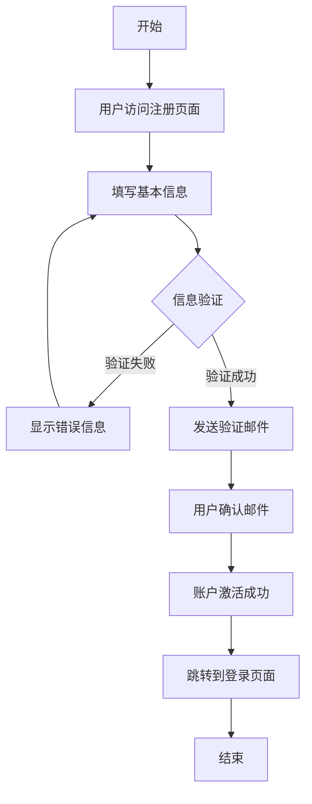

# AI Design Agent

一个基于 AI 的设计师助手应用，可以帮助用户生成设计稿和提供设计建议。

## 功能特性

- 🤖 AI 驱动的设计助手对话
- 📝 支持 Markdown 格式的消息展示
- 📊 支持 Mermaid 图表渲染
- 🎨 自动生成设计稿卡片
- 🖼️ 设计稿画廊展示
- 🔧 可配置的 OpenRouter API 集成

## 技术栈

- **前端框架**: React + TypeScript + Vite
- **样式**: Tailwind CSS
- **AI API**: OpenRouter (支持 OpenAI GPT-4)
- **Markdown 渲染**: react-markdown + remark-gfm
- **图表渲染**: Mermaid
- **图标**: Lucide React

## 界面布局

- **左侧**: 对话框区域
  - 支持 Markdown 格式消息
  - 支持 Mermaid 图表显示
  - 显示对话中生成的设计稿卡片
  
- **右侧**: 设计稿画廊
  - 仅展示生成的设计稿图片
  - 网格布局展示
  - 点击查看详情

## 快速开始

### 1. 安装依赖

```bash
npm install
```

### 2. 配置环境变量

复制 `.env.example` 文件为 `.env`：

```bash
cp .env.example .env
```

在 `.env` 文件中设置您的 OpenRouter API 密钥：

```bash
VITE_OPENROUTER_API_KEY=your_actual_api_key_here
```

### 3. 获取 OpenRouter API 密钥

1. 访问 [OpenRouter](https://openrouter.ai)
2. 注册账户
3. 获取 API 密钥
4. 将密钥添加到 `.env` 文件中

### 4. 启动开发服务器

```bash
npm run dev
```

应用将在 `http://localhost:5173` 启动。

### 5. 构建生产版本

```bash
npm run build
```

## 使用说明

1. **设置 API 密钥**: 首次使用时，点击"设置 API 密钥"按钮输入您的 OpenRouter API 密钥
2. **开始对话**: 在输入框中描述您的设计需求，如：
   - "设计一个简洁的登录页面"
   - "创建一个电商产品卡片组件"
   - "设计一个移动端导航菜单"
3. **查看设计稿**: AI 会根据您的需求生成设计建议，并在右侧画廊中展示相关的设计稿
4. **支持 Markdown**: 您可以在对话中使用 Markdown 格式，包括 Mermaid 图表

## 示例对话

```
用户: 设计一个用户注册流程图

AI: 我来为您设计一个清晰的用户注册流程图：



这个流程图展示了完整的用户注册过程...
```

## 项目结构

```
src/
├── components/          # React 组件
│   ├── Chat.tsx        # 主聊天组件
│   ├── ChatInput.tsx   # 聊天输入组件
│   ├── ChatMessage.tsx # 聊天消息组件
│   ├── DesignCard.tsx  # 设计卡片组件
│   └── DesignGallery.tsx # 设计画廊组件
├── services/           # API 服务
│   └── api.ts         # OpenRouter API 集成
├── types/             # TypeScript 类型定义
│   └── index.ts       # 主要类型定义
├── App.tsx           # 主应用组件
├── main.tsx          # 应用入口
└── index.css         # 全局样式
```

## 开发说明

### 添加新功能

1. 在 `src/types/index.ts` 中定义新的类型
2. 在 `src/components/` 中创建新组件
3. 在 `src/services/api.ts` 中添加 API 功能

### 自定义样式

项目使用 Tailwind CSS，您可以：
1. 修改 `tailwind.config.js` 自定义主题
2. 在 `src/index.css` 中添加全局样式

## 常见问题

### Q: API 密钥无效
A: 请确保在 OpenRouter 网站上获取了有效的 API 密钥，并正确设置在环境变量中。

### Q: 设计稿不显示
A: 目前使用模拟图片数据，实际应用中可以集成图片生成 API（如 DALL-E、Midjourney API）。

### Q: Mermaid 图表不显示
A: 确保图表语法正确，并检查浏览器控制台是否有错误信息。

## 许可证

MIT License

## 贡献

欢迎提交 Issue 和 Pull Request！
