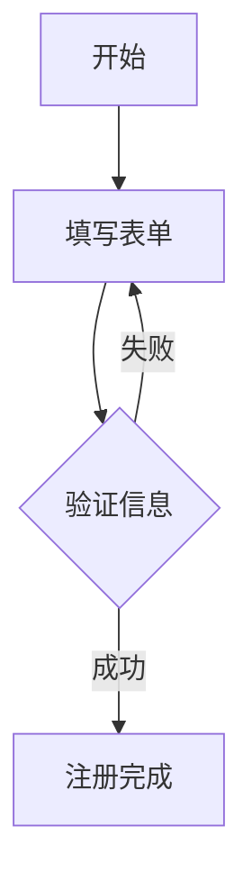

# 使用指南

## 项目概述

AI 设计师助手是一个基于 React + TypeScript 的 Web 应用，集成了 AI 聊天和图片生成功能，帮助用户进行 UI/UX 设计。

## 功能特性

- **AI 聊天对话**：基于 OpenRouter API 的智能设计师助手
- **实时图片生成**：使用 OpenAI DALL-E API 生成设计稿
- **设计卡片管理**：自动生成和管理设计作品
- **响应式界面**：适配各种设备的现代化 UI

## 环境配置

### 1. 复制环境变量文件
```bash
cp .env.example .env
```

### 2. 配置 API 密钥

在 `.env` 文件中配置以下密钥：

```env
# OpenRouter API Key (必需)
# 用于聊天功能，获取地址：https://openrouter.ai
VITE_OPENROUTER_API_KEY=your_openrouter_api_key_here

# OpenAI API Key (可选)
# 用于 DALL-E 图片生成，获取地址：https://platform.openai.com
VITE_OPENAI_API_KEY=your_openai_api_key_here
```

**注意**：
- OpenRouter API 密钥是必需的，用于基本的聊天功能
- OpenAI API 密钥是可选的，用于真实的图片生成功能
- 如果没有提供 OpenAI API 密钥，系统会使用模拟图片作为备选方案

## 运行项目

### 开发模式
```bash
npm run dev
```

### 生产构建
```bash
npm run build
npm run preview
```

## 使用说明

### 1. 设置 API 密钥

首次使用时，请点击设置按钮配置 API 密钥：
- 输入 OpenRouter API 密钥（必需）
- 输入 OpenAI API 密钥（可选，用于图片生成）

### 2. 开始对话

在聊天界面中描述您的设计需求，例如：
- "设计一个现代化的登录页面"
- "创建一个移动端电商应用的首页"
- "生成一个仪表板界面设计"

### 3. 图片生成

当您的对话包含设计相关的关键词时，系统会自动：
1. 使用 OpenAI DALL-E API 生成相关的设计稿图片
2. 如果 OpenAI API 不可用，则使用模拟图片作为备选
3. 将生成的设计卡片添加到设计画廊中

### 4. 设计管理

- 所有生成的设计稿会自动保存到设计画廊
- 可以查看设计稿的详细信息和生成时间
- 支持响应式布局，适配不同设备

## 技术栈

- **前端框架**：React 18 + TypeScript
- **构建工具**：Vite
- **样式框架**：Tailwind CSS
- **AI 服务**：OpenRouter API (聊天) + OpenAI API (图片生成)
- **HTTP 客户端**：Axios
- **图标库**：Lucide React

## API 集成说明

### OpenRouter API
- 用于处理聊天对话
- 支持多种 AI 模型
- 提供专业的设计建议

### OpenAI DALL-E API
- 用于生成真实的设计稿图片
- 支持高质量图片生成
- 自动优化提示词以生成更好的设计稿

## 故障排除

### 1. 图片生成失败
- 检查 OpenAI API 密钥是否正确
- 确认 API 配额是否充足
- 系统会自动回退到模拟图片

### 2. 聊天功能不可用
- 检查 OpenRouter API 密钥是否正确
- 确认网络连接正常

### 3. 构建错误
```bash
npm install
npm run build
```

## 许可证

本项目基于 MIT 许可证开源。

## 第一次运行项目

### 方法一：使用启动脚本（推荐）

```bash
./start.sh
```

启动脚本会自动：
- 检查并创建 `.env` 文件
- 安装必要的依赖
- 启动开发服务器

### 方法二：手动步骤

1. **复制环境变量文件**
   ```bash
   cp .env.example .env
   ```

2. **编辑环境变量**
   ```bash
   nano .env  # 或使用其他编辑器
   ```
   
   设置您的 OpenRouter API 密钥：
   ```
   VITE_OPENROUTER_API_KEY=sk-or-v1-xxxxxxxxxxxxx
   ```

3. **安装依赖（如果还没安装）**
   ```bash
   npm install
   ```

4. **启动开发服务器**
   ```bash
   npm run dev
   ```

## 获取 OpenRouter API 密钥

1. 访问 [OpenRouter](https://openrouter.ai)
2. 注册账户并登录
3. 在仪表板中生成新的 API 密钥
4. 复制密钥并粘贴到 `.env` 文件中

## 界面功能说明

### 左侧对话区域

- **消息输入框**: 在底部输入框中描述您的设计需求
- **消息展示**: 
  - 支持 Markdown 格式
  - 支持 Mermaid 图表
  - 显示设计稿卡片（如果生成）
- **设置按钮**: 点击右上角齿轮图标配置 API 密钥

### 右侧设计稿画廊

- **网格布局**: 展示所有生成的设计稿
- **点击查看**: 点击设计稿卡片查看详情
- **自动更新**: 当生成新设计稿时自动显示

## 使用示例

### 基础设计请求

```
用户输入：设计一个现代化的登录页面

AI 回复：我来为您设计一个现代化的登录页面...
[会生成设计稿卡片显示在右侧]
```

### 流程图设计

```
用户输入：创建一个用户注册流程图

AI 回复：


这个流程图展示了用户注册的完整过程...
```

### 组件设计

```
用户输入：设计一个电商产品卡片组件

AI 回复：我来为您设计一个电商产品卡片组件，包含以下元素：

- 产品图片
- 产品标题
- 价格信息
- 购买按钮
- 评分显示

[会生成对应的设计稿]
```

## 技术特性

### Markdown 支持

支持完整的 Markdown 语法：
- **粗体文本**
- *斜体文本*
- `代码块`
- 列表
- 链接
- 表格

### Mermaid 图表

支持多种图表类型：
- 流程图 (flowchart)
- 序列图 (sequence)
- 类图 (class)
- 状态图 (state)
- 甘特图 (gantt)

### 设计稿生成

当您的请求包含设计相关关键词时，系统会自动生成设计稿卡片：
- 设计
- 界面
- 页面
- 布局
- 组件
- UI/UX
- 原型

## 常见问题解决

### 1. API 密钥错误

**问题**: "OpenRouter API key is required" 或 "Failed to communicate with AI service"

**解决方案**:
- 检查 `.env` 文件是否存在
- 确认 API 密钥格式正确（以 `sk-or-v1-` 开头）
- 确认 API 密钥有效且有足够余额

### 2. 页面无法显示

**问题**: 页面空白或样式错误

**解决方案**:
```bash
# 清除缓存并重新安装
rm -rf node_modules package-lock.json
npm install
npm run dev
```

### 3. Mermaid 图表不显示

**问题**: 图表语法正确但不显示

**解决方案**:
- 确保图表语法完全正确
- 检查浏览器控制台是否有错误
- 尝试刷新页面

### 4. 设计稿不生成

**问题**: 对话正常但不生成设计稿

**原因**: 系统根据关键词检测是否生成设计稿

**解决方案**: 在请求中明确包含设计相关词汇，如：
- "设计一个..."
- "创建界面..."
- "设计页面..."

## 开发模式

启动开发服务器后：
- 访问 `http://localhost:5173`
- 代码修改会自动热重载
- 按 `Ctrl+C` 停止服务器

## 生产构建

```bash
npm run build
```

构建文件将生成在 `dist/` 目录中。

## 项目定制

### 修改 AI 模型

编辑 `src/services/api.ts`：
```typescript
model: 'openai/gpt-4'  // 改为其他模型
```

### 添加更多设计稿样式

编辑 `src/services/api.ts` 中的 `generateMockDesignCard` 方法。

### 自定义界面样式

项目使用 Tailwind CSS，您可以：
- 修改 `tailwind.config.js`
- 在 `src/index.css` 添加自定义样式